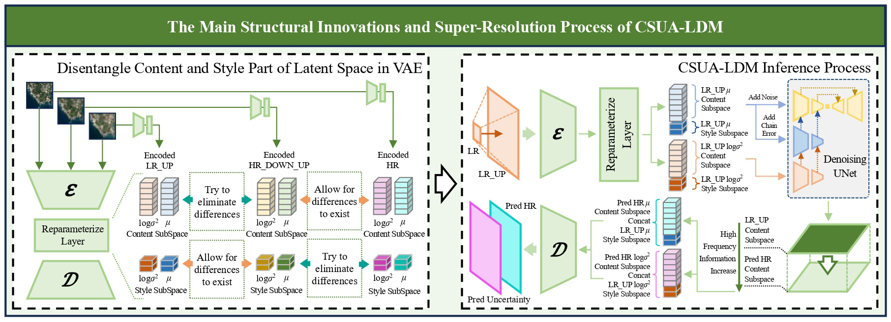
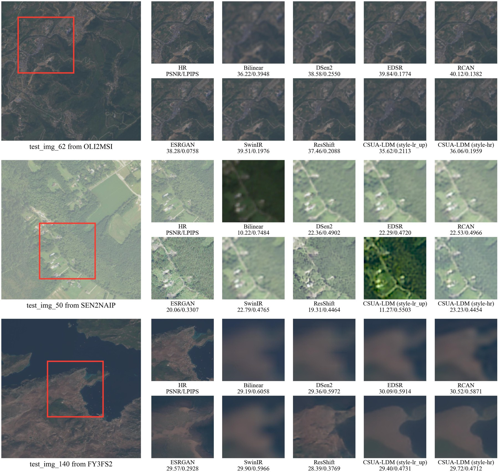
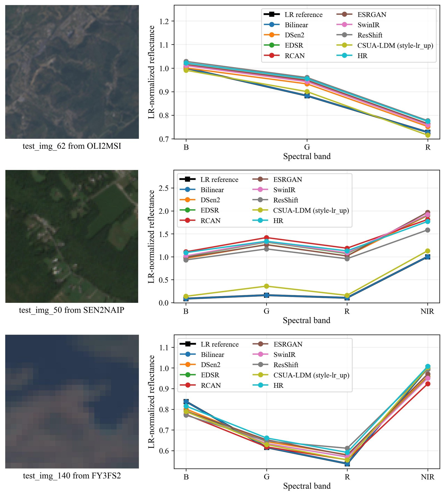
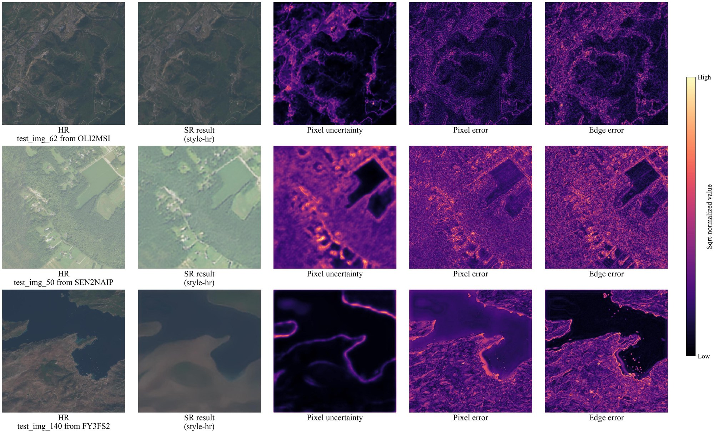

# CSUA-LDM

**CSUA-LDM: A Content–Style Disentangled Latent Diffusion Model With Uncertainty-Aware Guidance for Cross-Sensor Remote Sensing Image Super-Resolution**

CSUA-LDM is a latent diffusion framework for cross-sensor remote sensing image super-resolution (SR). It is designed to restore spatial details while preserving the spectral and radiometric characteristics of the source low-resolution (LR) sensor and estimating spatially resolved reconstruction uncertainty.

> This repository contains research code accompanying the CSUA-LDM manuscript. Original imagery is not distributed with this repository. Source links and split manifests for OLI2MSI and SEN2NAIP are provided in the dataset description. FY3FS2 will be released after the required redistribution approval is granted.

## Highlights

- **Content–style disentanglement:** A variational autoencoder (VAE) separates cross-sensor shared spatial structure from sensor-related spectral and radiometric characteristics in latent space.
- **Content-only latent diffusion:** Conditional diffusion is performed only in the six-channel content subspace, while the two-channel style representation is retained for joint decoding.
- **Uncertainty-aware reconstruction:** Heteroscedastic uncertainty is estimated during denoising, propagated to pixel space, and optionally used to modulate stochastic noise during reverse sampling.

The main processing chain is:

```text
LR image -> upsampling -> VAE encoding -> content diffusion
                                      \-> style preservation
restored content + selected style -> VAE decoding -> SR image + uncertainty map
```

## Pretrained Weights

Pretrained checkpoints (`.pth`) for the main CSUA-LDM model and its ablation variants are available on [Hugging Face](https://huggingface.co/FishKissBottle/CSUA-LDM).

## Framework

The overall architecture combines content-style disentanglement, content-only
latent diffusion, uncertainty propagation, and joint decoding:



## Visual Examples

### Spatial Detail Restoration

The figure compares representative results from OLI2MSI, SEN2NAIP, and FY3FS2. The red boxes mark the regions shown in the method-specific crops.



### Spectral Feature Preservation

The curves compare whole-image mean spectra after each SR result is mapped back to the LR domain. All curves within a sample use the same LR-derived scaling factor.



### Pixel Uncertainty

The visualization compares HR references, `style-hr` SR results, pixel uncertainty, pixel error, and edge error. Heatmap intensities are independently normalized and square-root transformed for display, so they indicate within-image spatial patterns rather than directly comparable absolute magnitudes.



### Curated Main-Model Outputs

The repository additionally provides two matched sets of main-model outputs:
standard DDPM and uncertainty-guided DDPM. Each set contains eight test
examples per dataset, with identical samples, center crops, decoding styles,
and random seeds. Every example includes a compact JPG comparison and
losslessly compressed, georeferenced, all-band SR GeoTIFFs for `style-lr_up`
and `style-hr`.

- [Standard DDPM examples](assets/examples/main_model_samples_ddpm/README.md)
- [Uncertainty-guided DDPM examples](assets/examples/main_model_samples_uncertainty_guided/README.md)

## Experimental Scope

The manuscript evaluates CSUA-LDM on three paired cross-sensor datasets:

| Dataset | LR sensor | HR sensor | LR/HR resolution | Scale | Bands |
|---|---|---|---|---:|---:|
| OLI2MSI | Landsat-8 OLI | Sentinel-2 MSI | 30 m / 10 m | 3x | 3 |
| SEN2NAIP | Sentinel-2 MSI | NAIP | 10 m / 2.5 m | 4x | 4 |
| FY3FS2 | FY-3F | Sentinel-2 MSI | 0.0025° / 0.00015625° | 16x | 4 |

For dataset sources, split protocols, and validation/test manifests, see [Dataset Description](Dataset_Description/DATASET_DESCRIPTION.md).

Spatial reconstruction is evaluated with PSNR, SSIM, GMSD, FSIM, and LPIPS. Spectral preservation is evaluated after mapping the SR result back to the LR domain using SAM, ERGAS, and SCC.

### Results at a Glance

| Dataset | PSNR (style-hr) ↑ | SSIM (style-hr) ↑ | SAM (style-lr_up) ↓ | SCC (style-lr_up) ↑ |
|---|---:|---:|---:|---:|
| OLI2MSI | 42.69 | 0.9639 | 1.3323 | 0.9781 |
| SEN2NAIP | 27.05 | 0.6361 | 4.9084 | 0.9767 |
| FY3FS2 | 32.81 | 0.8399 | 2.2128 | 0.9903 |

PSNR and SSIM use the paired-data `style-hr` control to assess spatial
reconstruction, whereas SAM and SCC use the deployable `style-lr_up` setting
to assess preservation of source-sensor spectral characteristics. Complete
comparisons are reported in the manuscript.

## Repository Structure

```text
CSUA_LDM_V1.0/
|-- assets/
|   |-- CSUA_LDM_framework.jpg        # Overall model framework
|   `-- examples/                     # README figures and supplementary outputs
|-- Dataset_Description/              # Dataset sources and split manifests
|-- Main_Model/                       # Main CSUA-LDM implementation
|   |-- CSUA_LDM_Config.py
|   |-- CSUA_LDM_SpatialEvaluate.py
|   |-- CSUA_LDM_SpectralEvaluate.py
|   |-- CSUA_LDM_VAE/
|   `-- CSUA_LDM_Diffusion/
|-- Ablation_Models/                  # NoDisent, NoUnc, and Vanilla variants
|-- Pre_Training/                     # Statistics and parameter calibration
|-- configs/
|   |-- datasets/                     # Dataset paths and normalization statistics
|   |-- runtime/                      # Shared training configuration
|   `-- variants/                     # Main and ablation configurations
|-- CSUA_LDM_Evaluation_Results/      # Local evaluation outputs (not distributed)
|-- CSUA_LDM_ConfigLoader.py
|-- CSUA_LDM_Dataset.py
|-- CSUA_LDM_Evaluate_Common.py
|-- CSUA_LDM_Quality_Metrics.py
|-- CSUA_LDM_Uncertainty_Guidance.py
|-- CSUA_LDM_Utils.py
`-- requirements.txt                # Tested Python dependencies
```

Model checkpoints, training logs, and bulk inference/evaluation outputs are
intentionally excluded from version control. Only the curated examples under
`assets/examples/` are intended to be uploaded with the source code. In
addition to the figures embedded above, this directory contains supplementary
main-model JPG and GeoTIFF outputs for closer inspection.

## Environment

The experiments in the manuscript were conducted with PyTorch and CUDA 12.1 on NVIDIA RTX 3090 and RTX 4060 GPUs. Python 3.11 is recommended.

Core dependencies include:

- PyTorch and torchvision
- NumPy and PyYAML
- GDAL (`osgeo`)
- Albumentations
- tqdm, Pillow, and Matplotlib
- TensorBoard
- PIQA and LPIPS

A tested environment can be prepared as follows. Install the PyTorch build
appropriate for your CUDA driver before installing the remaining Python
dependencies.

```bash
conda create -n csua-ldm python=3.11
conda activate csua-ldm
conda install -c conda-forge gdal=3.8.4
pip install torch==2.3.0 torchvision==0.18.0 --index-url https://download.pytorch.org/whl/cu121
pip install -r requirements.txt
```

The versions in `requirements.txt` reproduce the tested CUDA 12.1 environment.
For a different CUDA version, replace only the PyTorch installation command
with the corresponding command from the official PyTorch installation guide.
GPU training is strongly recommended, particularly for the diffusion stage.

## Dataset Preparation

For the complete workflow for a new paired dataset, see
[Training CSUA-LDM on a Custom Dataset](TRAIN_CUSTOM_DATASET.md).

Each dataset configuration is stored in `configs/datasets/`:

```text
configs/datasets/oli2msi.yaml
configs/datasets/sen2naip.yaml
configs/datasets/fy3fs2.yaml
```

Update the local dataset paths in the selected YAML file. The recommended flat directory layout is:

```text
DATASET_ROOT/
|-- train_lr/*.tif
|-- train_hr/*.tif
|-- valid_lr/*.tif
|-- valid_hr/*.tif
|-- test_lr/*.tif
|-- test_hr/*.tif
|-- draw_lr/*.tif       # Optional visualization split
`-- draw_hr/*.tif
```

Corresponding LR and HR files must use matching filenames. The expected channel order, scale factor, raw-value conversion, and normalization statistics are defined in the dataset YAML.

The model uses the following aligned crop sizes for training and evaluation:

| Dataset | Scale | LR crop size | HR crop size |
|---|---:|---:|---:|
| OLI2MSI | 3x | 128 x 128 | 384 x 384 |
| SEN2NAIP | 4x | 96 x 96 | 384 x 384 |
| FY3FS2 | 16x | 24 x 24 | 384 x 384 |

These values describe model input crops rather than complete GeoTIFF dimensions. Source images may be larger and are cropped by the dataset loader.

### Selecting a Dataset

SEN2NAIP is the default dataset. A different dataset can be selected without editing Python source code by setting `CSUA_LDM_DATASET_YAML_OVERRIDE` before running a command.

PowerShell:

```powershell
$env:CSUA_LDM_DATASET_YAML_OVERRIDE = (Resolve-Path "configs/datasets/oli2msi.yaml").Path
```

Bash:

```bash
export CSUA_LDM_DATASET_YAML_OVERRIDE="$(pwd)/configs/datasets/oli2msi.yaml"
```

To return to the default configuration:

```powershell
Remove-Item Env:CSUA_LDM_DATASET_YAML_OVERRIDE
```

All commands below should be run from the repository root.

## Configuration

The main experiment combines the following files:

- `configs/datasets/<dataset>.yaml`: paths, bands, scale, normalization, and degradation parameters.
- `configs/runtime/default_train.yaml`: shared optimizer, batch, scheduler, and runtime settings.
- `configs/variants/main.yaml`: latent dimensions, checkpoints, diffusion uncertainty, and sampling guidance.

Default manuscript settings include an eight-channel latent space split into six content channels and two style channels, a 1000-step diffusion process, Adam with an initial learning rate of `1e-4`, and EMA decay of `0.995`.

## Training Workflow

### 1. Compute Dataset Statistics

The following command computes statistics for a selected dataset and writes the resulting HR normalization values to its YAML configuration:

```bash
python Pre_Training/CSUA_LDM_Compute_Mean_Std.py --dataset sen2naip
```

Available dataset names are `oli2msi`, `sen2naip`, and `fy3fs2`. A custom configuration can be supplied with `--dataset-config` instead. Because this command modifies the selected YAML file, review the changes before training.

### 2. Calibrate the HR Degradation Kernel

The Gaussian blur strength can be searched on the validation split:

```bash
python Pre_Training/CSUA_LDM_Search_Best_HR_Gaussian_Params.py
```

The search reports candidate results. Update the corresponding Gaussian sigma and kernel size in the dataset YAML when adopting the selected parameters.

### 3. Train the VAE

```bash
python Main_Model/CSUA_LDM_VAE/CSUA_LDM_VAE_Code/CSUA_LDM_VAE_train.py
```

The VAE is trained before the diffusion model. It learns self-reconstruction, cross-reconstruction, content alignment, and latent uncertainty while separating content and sensor style.

### 4. Estimate the Latent Scaling Factor

After VAE training, estimate the runtime latent scaling factor:

```bash
python Main_Model/CSUA_LDM_VAE/CSUA_LDM_VAE_Code/CSUA_LDM_compute_scaling_factor.py
```

The result is written to `configs/variants/main.yaml`. Recompute it whenever the VAE or dataset normalization changes.

### 5. Train the Conditional Diffusion Model

```bash
python Main_Model/CSUA_LDM_Diffusion/CSUA_LDM_Diffusion_Code/CSUA_LDM_Diffusion_train.py
```

The diffusion model uses v-prediction and operates only on the content subspace. Checkpoint paths and resume behavior are controlled by `configs/variants/main.yaml`.

### 6. Tune Uncertainty Guidance (Optional)

After both stages have valid checkpoints, uncertainty-guidance parameters can be searched with:

```bash
python Pre_Training/CSUA_LDM_Search_Best_Uncertainty_Guidance_Params.py --dataset current
```

Use `--dataset all` to search all configured datasets. The guidance strength is dataset dependent and should be validated rather than assumed to improve every metric.

## Evaluation

### Spatial Reconstruction

```bash
python Main_Model/CSUA_LDM_SpatialEvaluate.py --style-source hr --sampling-uncertainty-guidance yaml
```

### Spectral Preservation

```bash
python Main_Model/CSUA_LDM_SpectralEvaluate.py --style-source lr_up --sampling-uncertainty-guidance yaml
```

`--sampling-uncertainty-guidance` accepts `yaml`, `on`, or `off`. The `yaml` option follows `configs/variants/main.yaml`, while `on` and `off` provide explicit evaluation-time overrides.

Both evaluation scripts perform paired-split inference before computing metrics and saving results. The `lr_up` style source preserves the spectral and radiometric characteristics of the source LR observation; `hr` is a paired-data control setting for spatial reconstruction; and `hr_down_up` provides an additional degraded-HR control. The repository does not currently provide a standalone deployment interface for arbitrary single LR images.

## Ablation Models and Comparison Protocol

The ablation implementations are organized under `Ablation_Models/`:

| Variant | Removed component |
|---|---|
| NoDisent | Content–style disentanglement |
| NoUnc | Uncertainty branch |
| Vanilla | Both disentanglement and uncertainty modeling |

Each variant contains its own config module, VAE/diffusion training scripts, and spatial/spectral evaluation scripts. Variant-specific settings are stored in `configs/variants/`.

The manuscript compares CSUA-LDM with:

- Bilinear interpolation
- DSen2
- EDSR
- RCAN
- ESRGAN
- SwinIR
- ResShift

The adapted third-party implementations are not redistributed in this repository. Official sources, required adaptations, configurations, weight provenance, and the common evaluation protocol are documented in [Comparison Model Reproduction](COMPARISON_MODELS.md).

## Reproducing the Manuscript Protocol

For a consistent comparison:

1. Use the same train/validation/test split for all methods.
2. Apply the same raw-value conversion and band order from the selected dataset YAML.
3. Train or evaluate all methods at the dataset-specific scale factor.
4. Use HR-referenced metrics for spatial reconstruction.
5. Degrade each SR result to the LR domain before computing SAM, ERGAS, and SCC.
6. Report the style source and whether uncertainty-guided sampling is enabled.

## Current Limitations

- Fine boundaries and fine-grained textures remain difficult to recover under a large LR/HR resolution gap and severe mixed-pixel effects.
- Iterative diffusion sampling is computationally expensive.
- The predicted uncertainty is intended for relative risk localization and has not been fully calibrated as an absolute probability of error.
- The datasets and a standalone single-image deployment interface are not currently bundled with the repository; pretrained checkpoints are distributed separately through Hugging Face.

## Authors

Qinping Yu, Wenpeng Lin, Yiting Ding, Youqi Xu, and Yi Wang

School of Environmental and Geographical Sciences, Shanghai Normal University, Shanghai, China.

Yangtze River Delta Urban Wetland Ecosystem National Field Scientific Observation and Research Station, Shanghai, China.

## Citation

Citation metadata will be added after publication. Until then, please refer to the manuscript by its title:

> CSUA-LDM: A Content–Style Disentangled Latent Diffusion Model With Uncertainty-Aware Guidance for Cross-Sensor Remote Sensing Image Super-Resolution.

## License

CSUA-LDM is released under the [MIT License](LICENSE).
