# Main-Model Output Examples: Standard DDPM

This directory contains eight CSUA-LDM test examples for each of the
OLI2MSI, SEN2NAIP, and FY3FS2 datasets. The examples use the first
test batch and the same data construction, EMA checkpoints, random seed,
and sampling path as `Main_Model/CSUA_LDM_SpatialEvaluate.py`.

The configuration uses 1000-step v-prediction DDPM sampling and disables uncertainty-guided noise gating.
The random seed is `999`. Both `style-lr_up` and `style-hr` outputs are
provided for exactly the same test samples and center-crop regions.

- OLI2MSI: `128 x 128 -> 384 x 384`
- SEN2NAIP: `96 x 96 -> 384 x 384`
- FY3FS2: `24 x 24 -> 384 x 384`

Each sample includes a JPEG preview and two all-band, georeferenced
Float32 GeoTIFFs. Square-root stretching is used only in the preview.
The GeoTIFF values remain in the model output range `[0, 1]`.

## Gallery

| Test index | OLI2MSI | SEN2NAIP | FY3FS2 |
|---:|---|---|---|
| 0 | 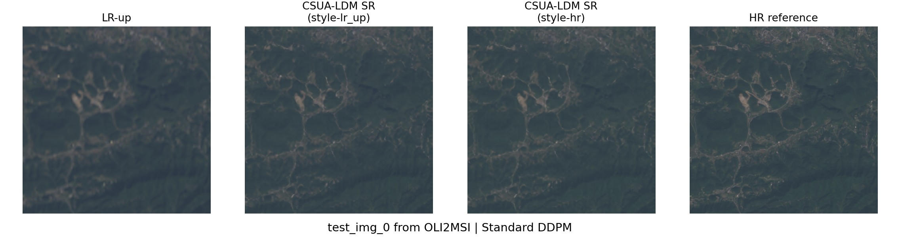 | 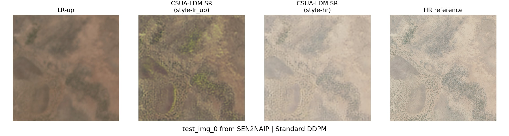 | 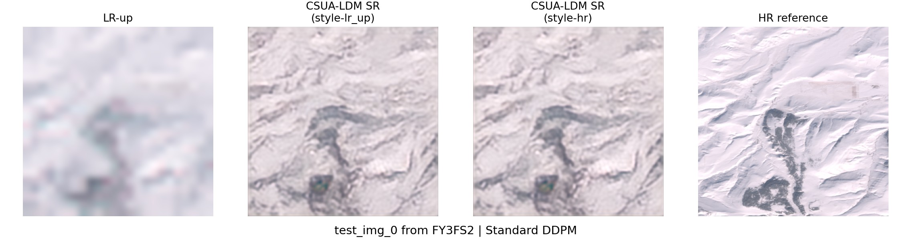 |
| 1 | 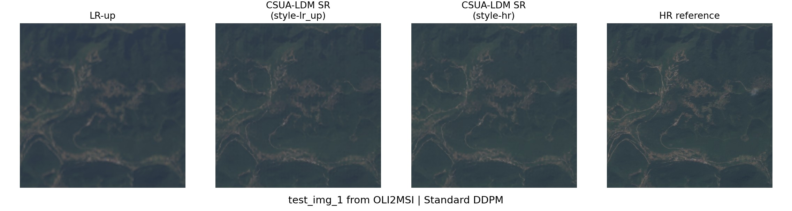 | 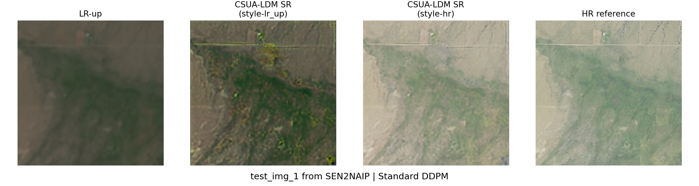 | 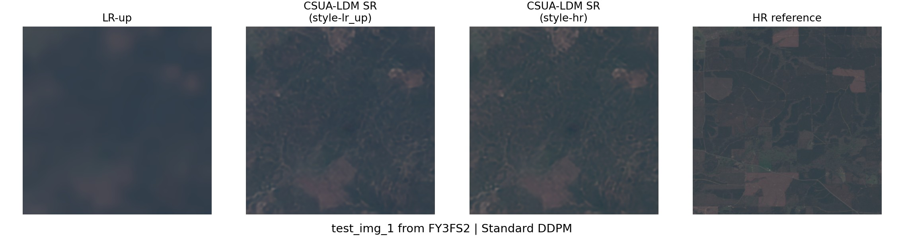 |
| 2 | 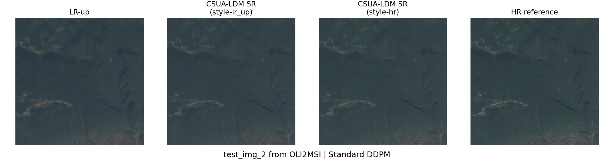 | 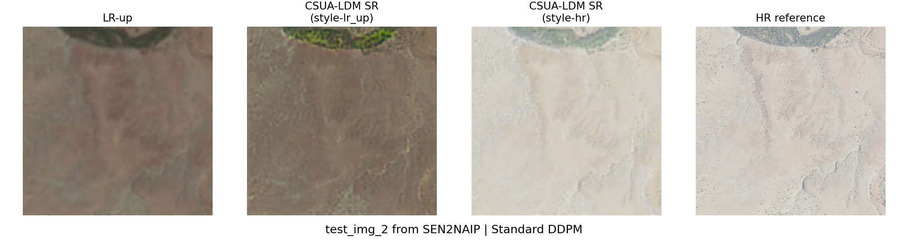 | 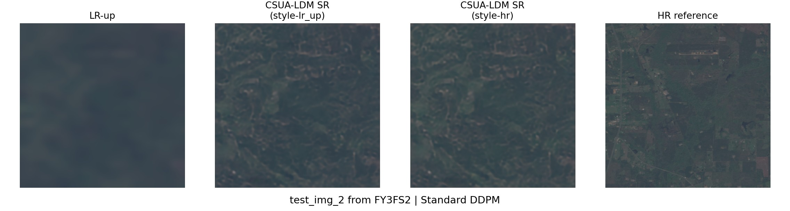 |
| 3 | 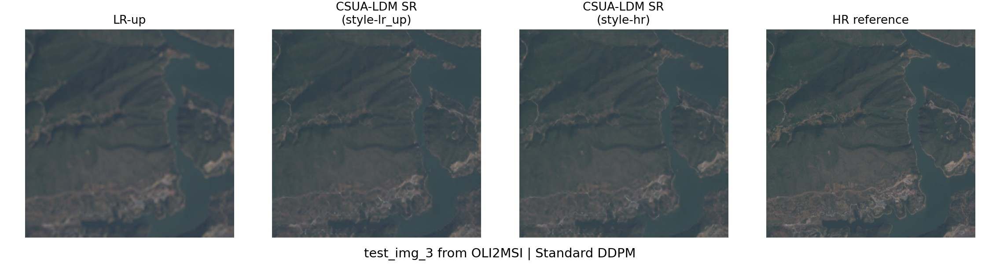 | 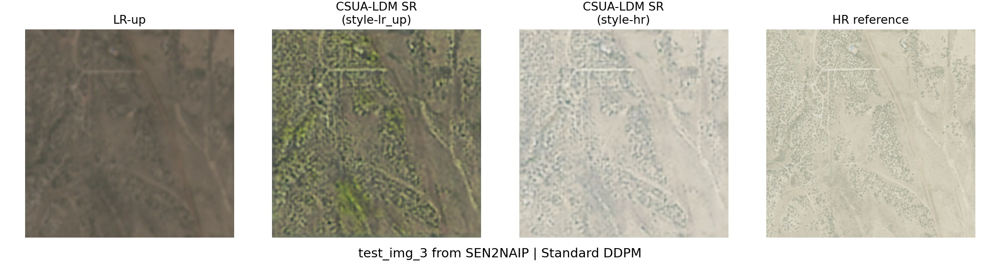 | 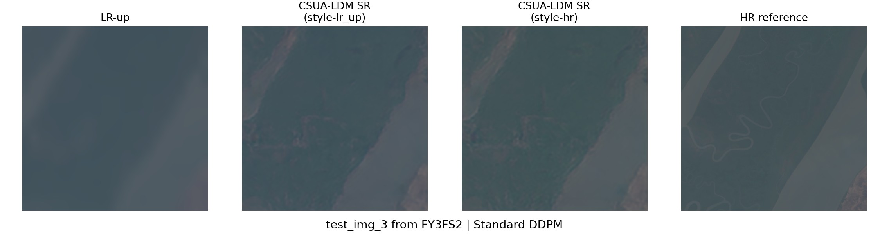 |
| 4 | 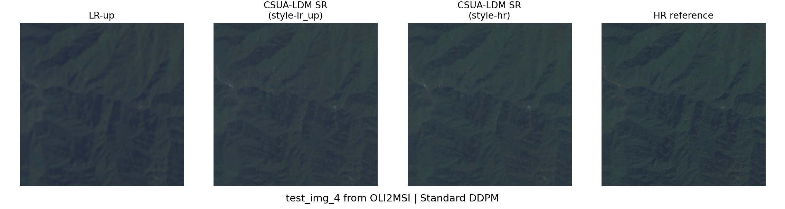 | 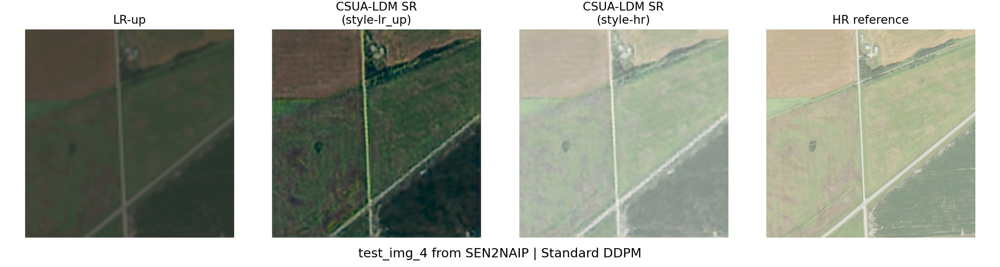 | 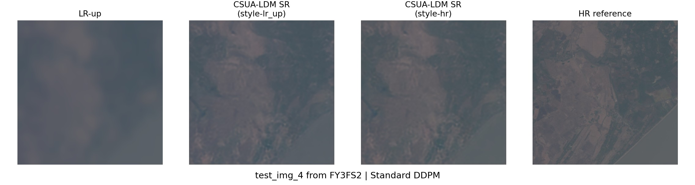 |
| 5 | 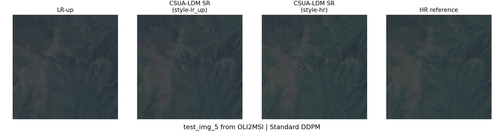 | 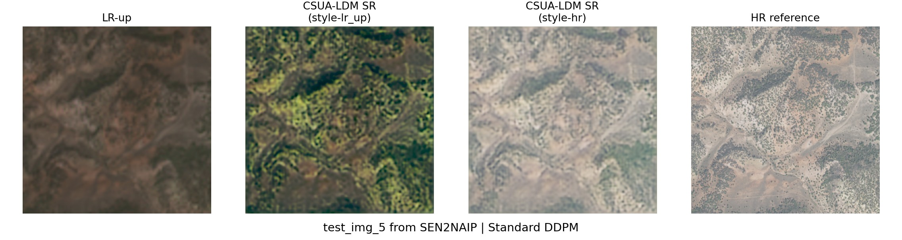 | 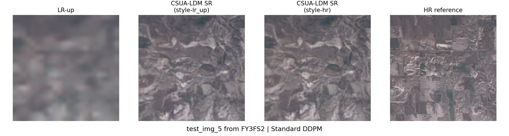 |
| 6 | 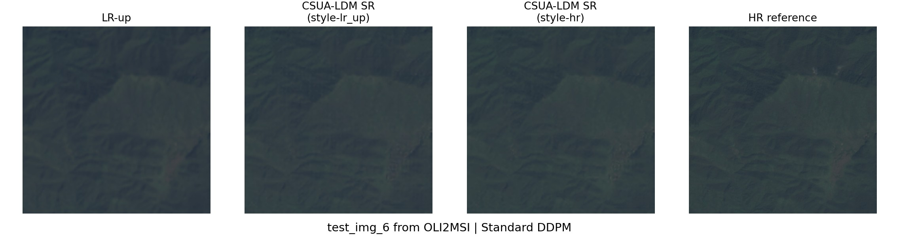 | 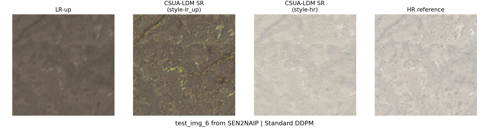 | 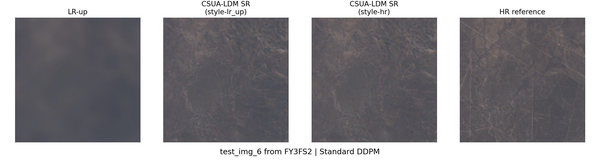 |
| 7 | 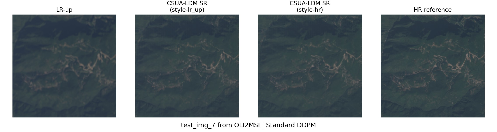 | 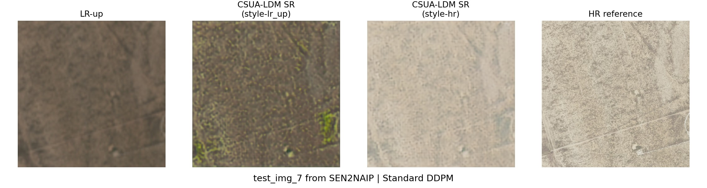 | 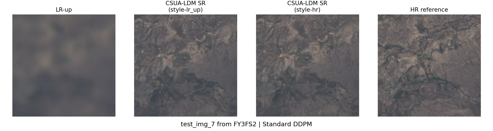 |

Original test filenames, sampling settings, and GeoTIFF paths are listed
in [manifest.csv](manifest.csv). The source datasets are not redistributed.
